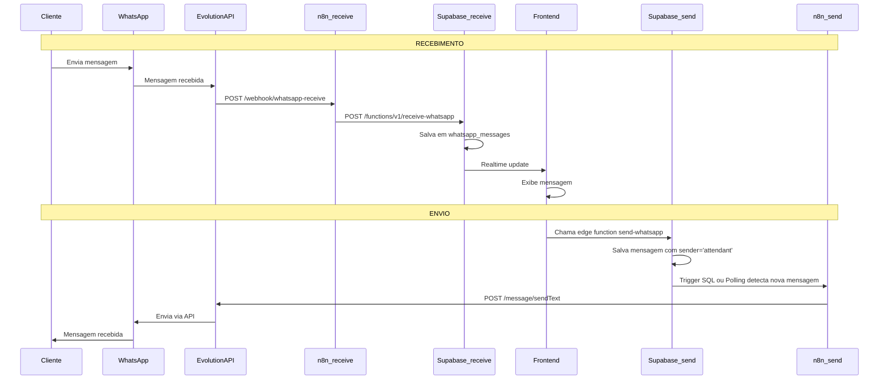

# 📱 Guia de Configuração WhatsApp via n8n

Este guia explica como configurar a integração do WhatsApp para cada loja do sistema usando n8n e Supabase.

---

## 🎯 Visão Geral

Cada loja terá sua própria integração WhatsApp independente através do n8n. O fluxo funciona assim:

### Fluxo de Recebimento (Cliente → Loja)
```
Cliente → WhatsApp → Evolution API → n8n → Supabase (receive-whatsapp) → Frontend
```

### Fluxo de Envio (Loja → Cliente)
```
Frontend → Supabase (send-whatsapp salva no BD) → n8n monitora BD → Evolution API → WhatsApp → Cliente
```

**Importante**: O n8n agora monitora o banco de dados Supabase para detectar novas mensagens dos atendentes e enviá-las automaticamente via WhatsApp.

---

## 📋 Pré-requisitos

1. **Conta no n8n** (n8n.io ou self-hosted)
2. **WhatsApp Business API** (Evolution API recomendado)
3. **Acesso ao painel administrativo** do CRM para habilitar WhatsApp por loja
4. **Supabase configurado** (já está pronto no projeto)

---

## 🔧 Passo 1: Configurar Integração WhatsApp (Evolution API)

### Instalação da Evolution API

1. Instale a Evolution API:
   - Docker: `docker run -p 8080:8080 atendai/evolution-api`
   - Ou use um serviço hospedado

2. Crie uma instância para cada loja:
   - Acesse: `http://seu-servidor:8080/manager`
   - Clique em "Create Instance"
   - Nome da instância: `loja-{id-da-loja}` ou `loja-{nome}`
   - Salve o token de autenticação

3. Conecte o WhatsApp:
   - Escaneie o QR Code com o WhatsApp da loja
   - Aguarde a conexão ser estabelecida

---

## 🔧 Passo 2: Criar Workflows no n8n

### 2.1 Workflow de RECEBIMENTO de Mensagens

Este workflow recebe mensagens do Evolution API e salva no Supabase.

**Nodes necessários:**

#### 1️⃣ **Webhook (Trigger)**
- Nome: "Receber Mensagem WhatsApp"
- HTTP Method: `POST`
- Path: `/webhook/whatsapp-receive`
- Response Mode: Immediately

#### 2️⃣ **Code (Processar Dados)**
- Nome: "Extrair Dados"
- Código JavaScript:
  ```javascript
  // Extrair dados da mensagem recebida do Evolution API
  const data = $input.all()[0].json;
  
  return [{
    json: {
      client_number: data.data.remoteJid.replace('@s.whatsapp.net', ''),
      message: data.data.message.conversation || data.data.message.extendedTextMessage?.text || '',
      sender: 'client',
      store_id: 'SEU_STORE_ID_AQUI', // Configure o store_id correto
      client_name: data.data.pushName || null
    }
  }];
  ```

#### 3️⃣ **HTTP Request (Chamar Edge Function)**
- Nome: "Salvar no Supabase"
- Method: `POST`
- URL: `https://sfvwxvpnjtwxcbkwqtaj.supabase.co/functions/v1/receive-whatsapp`
- Authentication: Header Auth
  - Name: `Authorization`
  - Value: `Bearer {SUPABASE_ANON_KEY}`
- Headers:
  ```json
  {
    "apikey": "{SUPABASE_ANON_KEY}",
    "Content-Type": "application/json"
  }
  ```
- Body (JSON):
  ```json
  {
    "clientNumber": "={{ $json.client_number }}",
    "message": "={{ $json.message }}",
    "clientName": "={{ $json.client_name }}",
    "store_id": "={{ $json.store_id }}"
  }
  ```

**Ative o workflow!**

---

### 2.2 Workflow de ENVIO de Mensagens (Monitoramento do Banco)

Este workflow monitora o banco de dados e envia mensagens quando o atendente responde.

**Opção A: Usando Supabase Trigger (Recomendado)**

#### 1️⃣ **Webhook (Trigger)**
- Nome: "Webhook do Supabase"
- HTTP Method: `POST`
- Path: `/webhook/whatsapp-send`
- Response Mode: Last Node

#### 2️⃣ **Configurar Trigger no Supabase**

No painel do Supabase, vá em **Database → Triggers** e crie:

```sql
-- Função que será chamada quando uma nova mensagem for inserida
CREATE OR REPLACE FUNCTION notify_new_message()
RETURNS TRIGGER AS $$
BEGIN
  -- Chama o webhook do n8n via HTTP request
  PERFORM net.http_post(
    url := 'https://seu-n8n.app.n8n.cloud/webhook/whatsapp-send',
    headers := '{"Content-Type": "application/json"}'::jsonb,
    body := jsonb_build_object(
      'id', NEW.id,
      'client_number', NEW.client_number,
      'message', NEW.message,
      'store_id', NEW.store_id
    )
  );
  RETURN NEW;
END;
$$ LANGUAGE plpgsql SECURITY DEFINER;

-- Trigger que executa a função
CREATE TRIGGER on_message_sent
AFTER INSERT ON whatsapp_messages
FOR EACH ROW
WHEN (NEW.sender = 'attendant')
EXECUTE FUNCTION notify_new_message();
```

#### 3️⃣ **Code (Processar Dados)**
- Nome: "Preparar Mensagem"
- Código:
  ```javascript
  const data = $input.all()[0].json.body;
  
  return [{
    json: {
      number: data.client_number + '@s.whatsapp.net',
      text: data.message
    }
  }];
  ```

#### 4️⃣ **HTTP Request (Evolution API)**
- Nome: "Enviar via WhatsApp"
- Method: `POST`
- URL: `http://seu-servidor-evolution:8080/message/sendText/{instance-name}`
- Authentication: Header Auth
  - Name: `apikey`
  - Value: `{token-evolution-api}`
- Body:
  ```json
  {
    "number": "={{ $json.number }}",
    "textMessage": {
      "text": "={{ $json.text }}"
    }
  }
  ```

**Ative o workflow!**

---

**Opção B: Usando Polling (Alternativa)**

Se preferir não usar triggers SQL, você pode configurar o n8n para fazer polling:

#### 1️⃣ **Schedule Trigger**
- Intervalo: A cada 10 segundos (ou conforme necessário)

#### 2️⃣ **Supabase Node**
- Operation: Select Rows
- Table: `whatsapp_messages`
- Filters:
  - `sender` equals `attendant`
  - `created_at` greater than "últimos 30 segundos" (usar expressão)
  
#### 3️⃣ **Loop Over Items**

#### 4️⃣ **HTTP Request (Evolution API)** (mesmo da Opção A)

#### 5️⃣ **Supabase Node**
- Operation: Update
- Marcar mensagem como processada (adicionar campo `sent_at`)

---

## 🏪 Passo 3: Habilitar WhatsApp por Loja

1. Acesse o painel da loja em **Minha Loja** (`/minha-loja`)

2. Na seção "WhatsApp Inteligente":
   - ✅ Marque como ativo

3. **Importante**: Configure o `store_id` correto no workflow do n8n!

---

## 🔗 Passo 4: Conectar Evolution API ao n8n

Configure a Evolution API para enviar mensagens recebidas para o n8n:

1. Acesse as configurações da instância no Evolution API
2. Configure o webhook de mensagens:
   - URL: `https://seu-n8n.app.n8n.cloud/webhook/whatsapp-receive`
3. Ative o webhook para eventos:
   - `messages.upsert` (mensagens recebidas)

---

## ✅ Passo 5: Testar a Integração

### Teste de RECEBIMENTO:

1. Envie uma mensagem do WhatsApp pessoal para o WhatsApp da loja
2. Verifique no n8n se o workflow de recebimento foi acionado
3. Verifique no Supabase se a mensagem foi salva na tabela `whatsapp_messages`
4. Verifique na interface do CRM se a mensagem apareceu na lista de conversas

### Teste de ENVIO:

1. Na interface do CRM, selecione uma conversa
2. Digite uma mensagem e envie
3. Verifique se a mensagem foi salva no banco com `sender='attendant'`
4. Verifique no n8n se o workflow de envio foi acionado (via trigger ou polling)
5. Verifique se a mensagem foi enviada via WhatsApp
6. Confirme que o cliente recebeu a mensagem

---

## 🎨 Campos da Tabela `stores` no Supabase

Certifique-se de que este campo existe na tabela `stores`:

```sql
- whatsapp_enabled: boolean (padrão: false)
```

**Nota**: Os campos `whatsapp_n8n_endpoint` e `whatsapp_n8n_token` não são mais necessários com o novo fluxo!

---

## 🔐 Segurança

1. **Store ID**: Sempre valide que a mensagem é da loja correta
2. **HTTPS**: Use HTTPS em produção para todos os webhooks
3. **Autenticação**: Use tokens válidos para autenticar chamadas
4. **Logs**: Monitore logs regularmente para detectar problemas

---

## 🚨 Troubleshooting

### Mensagens não chegam no CRM:
- ✅ Verifique se o webhook da Evolution API está configurado corretamente
- ✅ Verifique os logs do n8n (workflow de recebimento)
- ✅ Verifique se o `store_id` está correto
- ✅ Verifique os logs da edge function `receive-whatsapp`

### Mensagens não são enviadas:
- ✅ Verifique se o trigger SQL está funcionando (Opção A)
- ✅ Ou verifique se o polling está ativo (Opção B)
- ✅ Verifique os logs do n8n (workflow de envio)
- ✅ Verifique se a Evolution API está online
- ✅ Verifique se o WhatsApp está conectado
- ✅ Verifique os logs da edge function `send-whatsapp`

### Mensagens aparecem duplicadas:
- ✅ Verifique se há múltiplos webhooks configurados
- ✅ Certifique-se de que não há múltiplos triggers SQL ativos
- ✅ Verifique os logs do Supabase

---

## 📊 Monitoramento

### Logs importantes para acompanhar:

1. **n8n**: Execuções dos workflows (recebimento e envio)
2. **Edge Functions logs**: 
   - `supabase functions logs receive-whatsapp`
   - `supabase functions logs send-whatsapp`
3. **Evolution API**: Status da conexão WhatsApp
4. **Supabase**: Tabela `whatsapp_messages`

---

## 🔄 Fluxo Completo



---

## 📞 Próximos Passos

Após configuração básica funcionar:

1. ✅ Implementar atalhos de texto (`/pix`, `/endereco`)
2. ✅ Implementar PDV lateral completo
3. ✅ Finalização de vendas automática
4. ✅ Envio de resumo de pedido
5. ✅ Integração com fidelidade
6. ✅ Métricas e relatórios
7. ✅ Suporte a imagens e mídia
8. ✅ Chatbot com IA

---

## 💡 Dicas

- **Teste sempre com uma loja primeiro** antes de configurar todas
- **Monitore logs** constantemente no início
- **Documente** qual loja usa qual instância/número do Evolution API
- **Use triggers SQL** (Opção A) para melhor performance
- **Configure alertas** para falhas no n8n

---

## 🆕 Mudanças em Relação à Versão Anterior

### O que mudou:
- ❌ **Removido**: Necessidade de configurar endpoint e token do n8n no painel da loja
- ✅ **Novo**: n8n monitora o banco de dados Supabase diretamente
- ✅ **Simplificado**: Menos configuração por loja
- ✅ **Mais seguro**: Credenciais ficam apenas no n8n

### Benefícios:
- Configuração mais simples e centralizada
- Menos pontos de falha
- Mais fácil de debugar
- Melhor escalabilidade

---

**Pronto!** Agora você tem a integração WhatsApp funcionando com fluxo simplificado! 🎉
